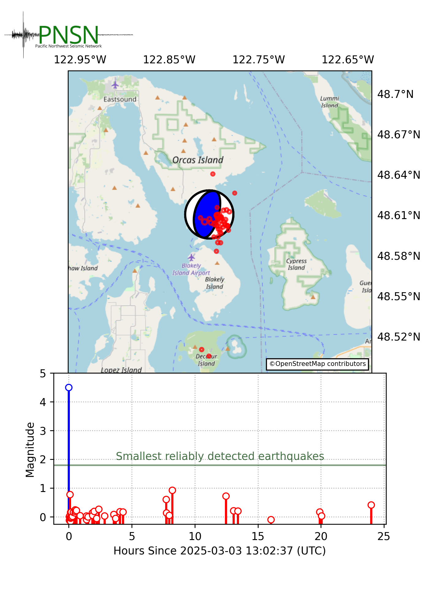

# M4.5_ORCAS_2025  
Visual review tools for identifying aftershocks of the M4.5 earthquake 10 km east of Orcas Island on March 3rd 2025
and rendering figures for PNSN website content.  



# Environment
The `conda` environment to use this repository can be installed using the included `environment.yml` file:  
```conda env create -f environment.yml```

# Event Exploration  
This repository centers around the `src/snuffle_aftershocks.py` script, which pulls continuous
waveform data from the IRIS Data Management Center and displays it in a [Snuffler](https://pyrocko.org/docs/current/apps/snuffler/tutorial.html)
GUI instance. Picks made during a Snuffler session are written to the `data/snuffler` directory both
as a time-stamped file (`markers_{timestamp}.dat`) and a working marker set `_markers_working.dat`.
In subsequent snuffler sessions, `_markers_working.dat` is loaded into the new session, allowing
continued accumulation of markers.  

We found that placing event markers on the first-arriving P-wave for candidate aftershocks and providing
a relative grading (kind, in snuffler-terms) to convey signal quality and likelihood of producing a location
for that event (i.e., how many stations could the event be seen on) was helpful in guiding targeted use
of Jiggle's "Scope" interface to characterize new events. For the M4.5 at Orcas Island, we composed a
station list `data/jiggle/jiggle_aftershock_stations.txt` that can be loaded into Jiggle's scope interface
to help streamline station selection.

# Displaying Jiggled Event Metadata  
The other codes in `src` focus on using event metadata exported from AQMS's Jiggle GUI
to populate an event map and magnitude time-series plot. The current basemap
uses [OpenStreetMap](https://www.openstreetmap.org/#map=5/38.01/-95.84) tiles consistent
with their terms of use.

# Authors
Nathan T. Stevens (ntsteven@uw.edu)  
Alex Hutko (ahutko@uw.edu)  

# License
GNU General Public License v3 (GPLv3)